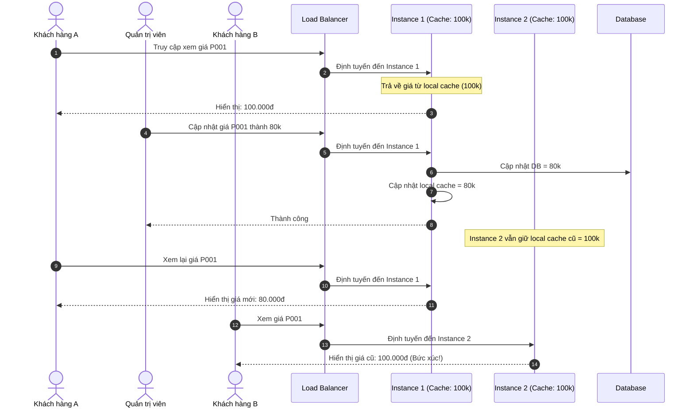

# BÁO CÁO PHÂN TÍCH VÀ KHẮC PHỤC LỖI BÁN GIÁ KHÔNG ĐỒNG NHẤT

## 1. PHÂN TÍCH NGUYÊN NHÂN LỖI "BÁN GIÁ KHÔNG ĐỒNG NHẤT"

### Nguyên nhân kỹ thuật
Trong kiến trúc hiện tại, hệ thống Flash Sale đang sử dụng một `HashMap` cục bộ (`localPriceCache`) để làm cache lưu trữ giá sản phẩm trong mỗi instance dịch vụ. 
Khi hệ thống chạy ở quy mô lớn với 10 instances độc lập phía sau một Load Balancer, mỗi instance sẽ sở hữu một vùng nhớ Heap riêng biệt chứa một bản sao `HashMap` độc lập. 

Điều này dẫn đến các vấn đề nghiêm trọng sau:
1. **Thiếu cơ chế đồng bộ hóa (No Sync mechanism):** Khi một thao tác cập nhật giá sản phẩm được thực hiện, chỉ có instance tiếp nhận request xử lý cập nhật (ví dụ: `Instance 1`) thay đổi được giá trị trong `localPriceCache` của nó. 9 instances còn lại không hề có cơ chế nhận biết sự thay đổi này và vẫn tiếp tục lưu giữ giá trị cũ (Stale Data).
2. **Định tuyến ngẫu nhiên (Load Balancing):** Load Balancer sẽ phân phối requests của người dùng đến 10 instances theo các thuật toán như Round Robin hoặc Least Connections. Vì thế, người dùng truy cập liên tiếp hoặc hai người dùng truy cập cùng lúc có thể bị định tuyến vào các instance khác nhau, dẫn đến việc nhìn thấy hai mức giá khác nhau cho cùng một sản phẩm tại cùng một thời điểm.

### Sơ đồ luồng gây mất nhất quán dữ liệu

### Minh họa Test Case cụ thể (Sản phẩm P001)

| Mốc thời gian | Tác nhân | Hành động | Trạng thái Instance 1 | Trạng thái Instance 2 | Trạng thái Database | Kết quả hiển thị thực tế |
| :--- | :--- | :--- | :--- | :--- | :--- | :--- |
| **T0** | Hệ thống | Khởi tạo hệ thống | Cache: Trống | Cache: Trống | Giá: 100.000đ | Chưa có truy vấn |
| **T1** | Khách hàng A & B | Đồng thời truy vấn giá của P001 | Cache: 100.000đ (đọc từ DB) | Cache: 100.000đ (đọc từ DB) | Giá: 100.000đ | Cả 2 khách hàng đều thấy giá **100.000đ** |
| **T2** | Admin | Cập nhật giá P001 từ 100k xuống 80k (Request gửi tới Instance 1) | Cache: **80.000đ** (đã cập nhật) | Cache: **100.000đ** (vẫn giữ nguyên giá cũ) | Giá: **80.000đ** | Admin nhận thông báo cập nhật thành công |
| **T3** | Khách hàng A & B | Đồng thời tải lại trang để mua Flash Sale | Request định tuyến vào Instance 1 | Request định tuyến vào Instance 2 | Giá: 80.000đ | Khách hàng A thấy giá **80.000đ** Khách hàng B thấy giá **100.000đ** (Mất nhất quán!) |

---

## 2. GIẢI PHÁP KHẮC PHỤC

Để giải quyết triệt để vấn đề này, chúng ta cần thay thế hoàn toàn **Local Cache (HashMap)** bằng **Distributed Cache (Redis)**. Khi đó, tất cả 10 instances đều đọc/ghi tập trung vào một Server Redis duy nhất, đảm bảo tính nhất quán dữ liệu tuyệt đối (Strong Consistency) ngay khi có thao tác cập nhật giá.

### Các cải tiến bổ sung:
1. **Xử lý lỗi Redis Down (Cơ chế Fallback):** Cấu hình một `CacheErrorHandler` tùy chỉnh để khi Redis gặp sự cố kết nối, ứng dụng sẽ tự động chuyển hướng truy vấn trực tiếp xuống Database thay vì văng lỗi 500 ra cho người dùng. Hệ thống vẫn chạy bình thường với hiệu năng thấp hơn một chút (Graceful Degradation).
2. **Chống tạo Key rác (Fail-Fast Validation):** Viết cơ chế validate nghiêm ngặt ngay tại tầng Service đầu vào để lọc bỏ các `productId` có giá trị `null`, rỗng (`""`) hoặc không hợp lý trước khi gọi đến tầng Cache/Database.

---

## 3. MÃ NGUỒN KHẮC PHỤC CHI TIẾT